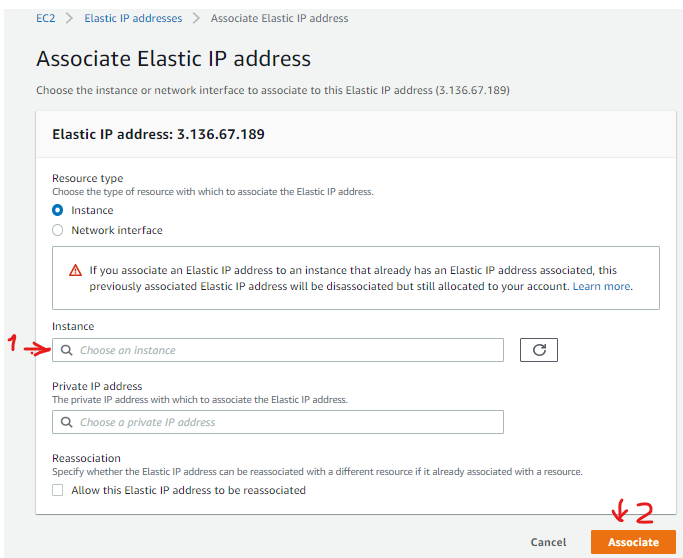
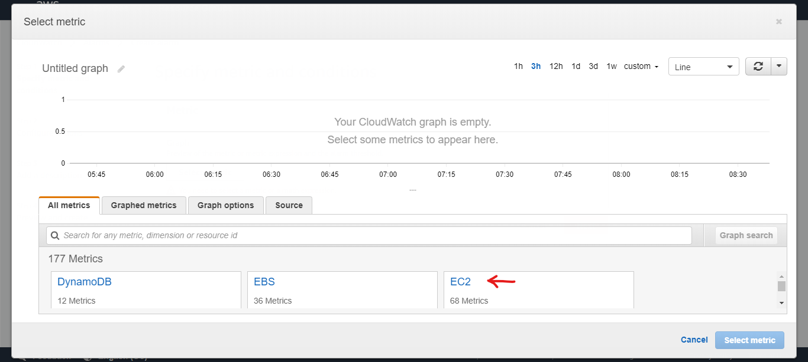

## 1 Choose an AMI

An AMI ([Amazon Machine Image](http://docs.aws.amazon.com/AWSEC2/latest/UserGuide/AMIs.html)) is virtual machine image ready to run a determined SO (Linux or Windows). I recommend using the latest Ubuntu Server realease. At this time is Ubuntu Server 18.04 LTS (HVM) , SSD Volume Type.


## 2 Choose an instance Type

A micro instance is enough for the initial setup.


## 3 Configure instance details

For our purpose, this tab can be ignore. Just so you know, here you can choose to create several instances, request spot instances, choose vpc between ohers. 


## 4 Add Storage

I recommend to use 16 GBs. That would be enoguh to install docker and jupyter image. To store datasets we are going to use S3.


## 5 Add Tags

For our purpose, this tab can be ignore. 


## 6 Configure Security Group

Choose "Create a new security group". Then give a name for the security group, for example "jupyter-docker-security-group". Then give a description for example "Ports: 22,8888,2376,443".

Then configure the following security rules as in the image:  


## 7 Review Instance Launch

This tab shows a resume for the configuration of the ec2 instance. Verify and then just click launch.


## 8 Create a Key Pair

They are going to ask you to select or create a new key pair. We are going to create a new one. Just put a name to the key and then save it. Its important not to lose the key pair because you wont be able to get later.


## 9 Setting a Static IP Adress

Before connecting to the ec2 instance, we are going to set a static ip adress. Each time an instance is run, AWS assigns a public ip to reach through internet. So each time you run the instance you are going to get a different public ip. You can deal with that but I prefer to have a static ip. This way your string connection won't change.

To create a static ip you have to allocate an elastic ip adress. To do that go to the left panel in "Network & Security" group you are going to find "Elastic IPs". Then click on "Allocate Elastic IP address" 


Then just click on "Allocate".


Then we have to associate the elastic ip address to the ec2 instance we launched before. To do that click on "Actions", then "Associate Elastic IP Adress".


Then select the instance and then click on "Associate".



## 10 Connect to your instance

To connect to your instance you need an ssh client. It can be git bash, putty, moba exterm, or even power shell. I going to use "visual studio code" because you can edit files like they are local and send commands through console in the same workspace.

So after installing vscode. Go to extensions in the left panel and type "remote development". Install the first option.


Then go to aws, make sure the instance is running. 

Locate your aws key pair into "C:\Users\UserName"

Then add a new connection in SSH Targets.


 
```
ssh -i "[aws key pair name]" ubuntu@[elastic ip address]
```


Press control + "ñ" to open the terminal.


## 11 Create alarm to stop ec2 instance if inactivity

Since this instance is going to be use for development purpose, its recommended creating a cloudwatch alarm to stop the ec2 instance in case it is not used. This way we avoid unexpected charges.


### 11.1 Creating Cloudwatch Alarm

#### 11.1.2 Specify metric and conditions

First you will select the metric to use to set a threshold. Just click en select metric.


Then select "EC2" metrics.


Then select "Per-Instance Metrics"


Then filter your instanceid and filter "cpuutilization"(1). Then select your instanceid-metric(2). Then just click the button "Select metric" (3).


Then you have to select the statistic and the period. In Statictics, select "Average". In period, select "1 minute". It should appear as in the image.


Then you have to set the conditions. First select "Static" as thresold type(1). Then in "Whenever CPUUtilization is..." select "Lower"(2).
Then define the threshold at 5 percent(3). At this time I recommend to use this value. If you experiment that your ec2 instance turns off unexpectedly while your are working on the ec2 instance then decrease this value.

Then define the number of datapoints will cause the ALARM state. Each datapoint has one minute of period. "a out of b" means if "a" points of the last "b" points are out of threshold, the alarm will go to ALARM state.
I recommend to use 30 of 30 (4). This means that is going to pass 30 minutes of cpu utilization less than 5% . Again if you experiment that your ec2 instance turns off unexpectedly while your are working on the ec2 instance then increase this value. 

Finally select "Treat missing data as bad (breaching threshold)" just in case we dont have the datapoint we are going to treat it as a bad point (5).


#### 11.1.2 Configure Actions

First, remove the notification. We dont want to be aware of alarms states. We want to stop the ec2 instance smoothly.


Then click on "Add ec2 action". 


In "Whenever this alarm state is" select "in Alarm". Then select the action "Stop this instance"


#### 11.1.3 Add Description

Then define a unique name and a description for the alarm. For example, "Stop inactive ec2 instance : i-0d1e1d80f7d901dd8" as an alarm name. And a description like "Stop ec2 instance when cpu utilization is less than 5%". Then click on "Next"


#### 11.1.4 Preview and Create

Finally you get a preview just to confirm the configurations. Click on "Create".


Then you are going to be send to the panel of active alarms. You can see in the image that the alarm has been setup.


## 11.2 Add a cpu stress in the initialization file of the ec2 instance

To make sure the alarm does work, we are going to add a cpu stress when the instance initialize. 

sudo nano /etc/rc.local


